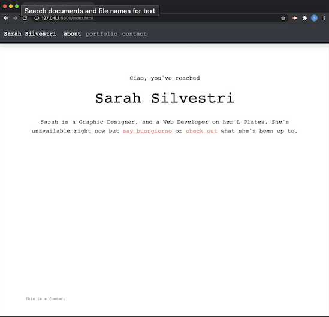
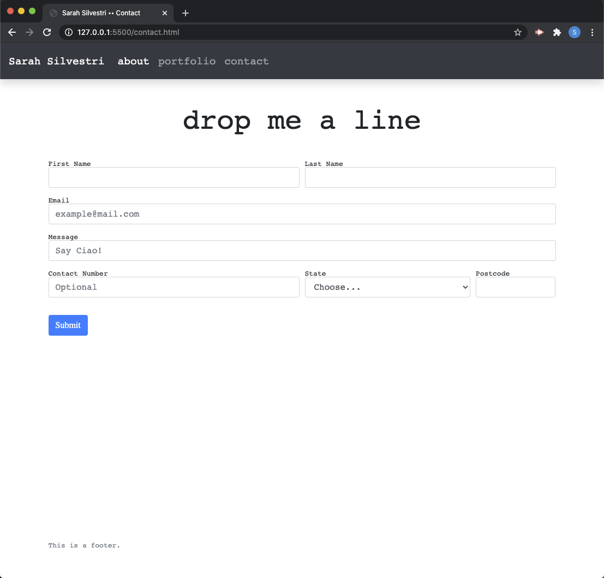
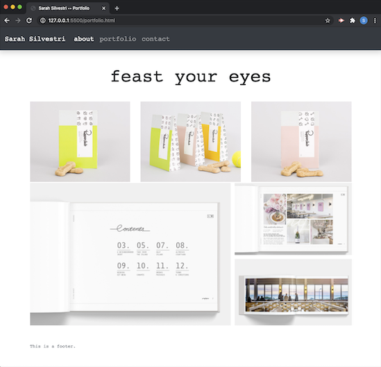

# CSS-Bootstrap-Homework-2

## Description

This project is our first website containig our portfolio including 3 pages (index.html // portfolio.html // contact.html)

A navbar and footer is present on all pages along with a responsive layout using bootstrap code with columns and resposive images.

Semantic html is present along with some styling with CSS. Bio & Contact form can also be found.

## Installation
link to gitHub >  https://github.com/silvsarah/CSS-Bootstrap-Homework-2

link to the website > https://silvsarah.github.io/CSS-Bootstrap-Homework-2/index.html

# Screenshots

